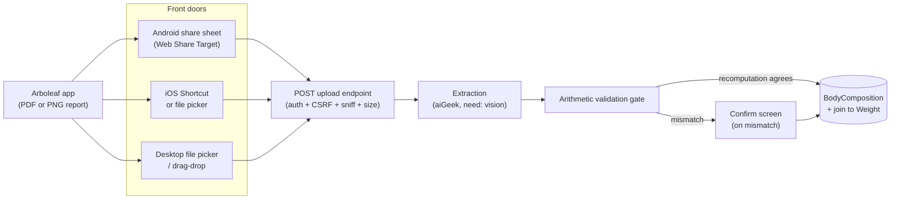

# FitnessGeek — Body Composition Intake

How an Arboleaf smart-scale body-composition scan gets from the scale into FitnessGeek,
what of it we store, and why most of the report is deliberately thrown away.

Written 2026-09-16 during the build. Status of each piece is tracked in §8.

---

## 1. Why this exists

FitnessGeek's `Weight` model stores exactly one number. The Arboleaf scale produces a
full body-composition scan — roughly fifty printed values — and the app had nowhere to
put any of it.

The obvious integration paths do not work:

- **Garmin Connect exports, it does not ingest.** It will not accept a third-party
  scale's body composition. `garminConnectService.js` already pulls `weightLbs` and
  pushes weight back; that is the whole surface, and it is not extensible to this.
- **Health Connect is lossy.** It carries `Weight`, `BodyFat`, `BoneMass`,
  `LeanBodyMass`, `BodyWaterMass` and `BasalMetabolicRate` — so it drops protein,
  skeletal muscle, subcutaneous and visceral fat, and **all ten segmental values**,
  since neither Health Connect nor Garmin has per-limb fields at all. Bridging
  Arboleaf → Health Connect → anything buys a worse copy of what the report already
  contains.

The only lossless source is the report the Arboleaf app itself produces, which it can
share as a PDF or a PNG. So the report *is* the integration.

The cadence argument follows from that: sharing a file from the scale app is less work
than typing a weight by hand, so in practice most weigh-ins will carry a full scan.
This is not an occasional bulk-import path. It is the normal one.

---

## 2. Intake architecture



The endpoint is deliberately dumb: it accepts `multipart/form-data` with a file and does
not care who sent it. Every platform difference is therefore a client-side difference
only, which is what keeps the iOS gap (§3) from becoming an architectural one.

---

## 3. Platform support — the share sheet is Android-only

**Safari implements Web Share, not Web Share Target.** `navigator.share()` works on iOS,
so a web app can push *out* to the share sheet. The inbound half — registering a PWA as a
destination that appears *in* the sheet — has never shipped in WebKit. An installed iOS
PWA simply does not appear as a target.

| Platform | Front door | Notes |
|----------|-----------|-------|
| **Android** | `share_target` in the manifest → POST | The intended path. Requires the PWA to be installed. |
| **iOS** | An iOS Shortcut registered to the share sheet, POSTing to the same endpoint | Restores share-sheet behaviour. One-time per-device setup. |
| **iOS, no setup** | `<input type="file">` in-app | Works in Safari today. Arboleaf saves to Files, user picks it. Two extra taps. |
| **Desktop** | File picker / drag-drop | Also the re-import path for old scans. |

The file picker is not a consolation prize — it is wanted anyway, for desktop and for
re-importing a scan that was missed. Build it regardless of platform.

*Verify against WebKit release notes before assuming this is still true — it is exactly
the kind of gap that eventually closes.*

---

## 4. Which file to send

**Send the PDF.** Both formats carry identical numbers, but:

| | `arboleaf.pdf` | `arboleaf.png` |
|---|---|---|
| Real format | PDF 1.4, 2 pages, **no text layer** (each page is a single embedded image at 76 ppi) | **JPEG** despite the extension |
| Dimensions | 1714 x 2797 (page 1 carries the complete dataset) | 1080 x **10037** |
| As vision input | One image, no preprocessing | Must be sliced server-side first |

That last row is the operative one. Vision APIs downscale to a maximum long edge
(Claude's is ~1568 px), so a 10 037 px-tall screenshot arrives at the model roughly 6x
reduced and the text is unreadable. It cannot be sent as a single image — reading it
during design required slicing it into 8 chunks.

Accept both formats, since Arboleaf offers both and users will send either. Detect the
tall screenshot and slice it; pass the PDF straight through.

**Do not trust the file extension.** The sample file named `arboleaf.png` is JPEG data.
Sniff content.

---

## 5. What we store, and what we throw away

The scale measures exactly two things: weight (load cells) and bioelectrical impedance.
Every other number on the report is a regression or an arithmetic consequence. The rule
for storage is therefore:

> **Store a value only if it cannot be recomputed exactly from the other stored values.**

### 5.1 Stored — whole body (8)

| Field | Unit | Sample |
|---|---|---|
| `weight_value` | lb | 317.2 |
| `body_fat_mass_lb` | lb | 140.2 |
| `body_water_l` | **L** (not lb — the report gives litres) | 59.4 |
| `protein_lb` | lb | 33.6 |
| `bone_mass_lb` | lb | 12.4 |
| `skeletal_muscle_lb` | lb | 102.4 |
| `subcutaneous_fat_lb` | lb | 112 |
| `visceral_fat_index` | **unitless index, not a mass** | 20 |

The last two are easy to mistake for derived values and are not. Subcutaneous fat looks
like `total_fat - visceral_fat`, but visceral fat is printed as an *index*, not a mass, so
that subtraction is impossible — subcutaneous is an independent regression output.

### 5.2 Stored — segmental (10)

Five segments (`left_arm`, `right_arm`, `trunk`, `left_leg`, `right_leg`), each with
`muscle_lb` and `fat_lb`.

These are real measurements, not decoration: SMI reproduces exactly from the four limb
muscle values (§5.4), which means this is an 8-electrode scale and the per-limb figures
are measured rather than modelled. **Nothing downstream of the report carries them** —
neither Garmin nor Health Connect has per-limb fields — so if they are not captured here
they are lost.

### 5.3 Thrown away

Every percentage (each is just `value / weight`), fat-free mass, muscle mass, BMI, BMR,
SMI, and the whole-body "normal range" columns — all recomputed on read per §5.4.

Also discarded, permanently:

- **Metabolic age, fitness score, body type** — proprietary marketing composites.
- **The "compared to normal" segmental column.** It prints 923.3%, 900.8%, 746.4%,
  438.6% against limb fat. Those are not plausible at any body composition, and the PDF's
  own left panel prints the same figures, so it is a scaling bug in Arboleaf's report
  generator rather than a render artifact. It is a comparison ratio, not a measurement;
  dropping it costs nothing.
- **Waist-hip ratio (1.3).** A scale cannot measure this. It is a model estimate or a
  stale manual entry. Do not import it.

### 5.4 The derivation table — verified against the real scan

Every one of these was checked numerically against the 2026-09-16 scan before being
classed as derived:

| Derived value | Formula | Computed | Printed |
|---|---|---|---|
| `fat_free_mass` | `weight - body_fat_mass` | 177.0 | 177 |
| `muscle_mass` | `fat_free_mass - bone_mass` | 164.6 | 164.6 |
| `body_fat_%` | `body_fat_mass / weight` | 44.20 % | 44.2 % |
| `body_water_%` | `water_kg / weight_kg` | 41.3 % | 41.3 % |
| `protein_%`, `bone_%`, `skeletal_%` | `value / weight` | — | all match |
| `BMR` | `370 + 21.6 x fat_free_mass_kg` (**Katch-McArdle**) | 2104 | 2105 |
| `SMI` | `appendicular_muscle_kg / height_m^2` | 11.31 | 11.3 |
| `BMI` | `weight_kg / height_m^2` | 44.4 @ 1.80 m | 44.4 |

Two notes that matter for the gate:

- **BMR is not proprietary.** It is plain Katch-McArdle off lean mass. Worth knowing —
  it means the scale's BMR carries no information the stored fields do not.
- **BMI and SMI are height-sensitive.** The scale rounds height to 1.80 m; recomputing
  from a more precise stored height (1.8034 m for 5'11") gives 44.2 rather than 44.4.
  Neither is wrong. The gate must use a tolerance, not equality.

---

## 6. The arithmetic validation gate

Because §5.4 holds, **the report validates its own transcription.** This is what makes
unattended extraction safe enough to run on every weigh-in.

After extraction, recompute the derived values from the extracted primaries and compare
against the values printed on the report:

- **Agreement** → high confidence the extraction is correct; store the primaries.
- **Mismatch** → a misread digit. Route to a confirm screen rather than saving.

Without this gate, a single hallucinated or misread digit enters the history silently and
pollutes every trend built on top of it, with nothing downstream to catch it. With it,
the failure mode becomes a prompt rather than corruption.

Use a tolerance band, not equality: printed values carry one decimal place, and BMI/SMI
additionally depend on height rounding (§5.4).

The gate is worth building even if extraction were done by hand — it catches typos at the
point of entry.

---

## 7. Deduplication

The same physical scan will arrive twice: a user may share the PDF and then the PNG of
one measurement, or re-share the same file after a failure.

**A file hash is the wrong key** — two different files can represent one measurement
event. Key on `userId` + `measured_at`, where `measured_at` is the scan timestamp printed
on the report (e.g. `09/16/2026 08:01`), which both formats carry. Enforced by a unique
compound index.

Note the UTC Date Separation Principle (`THE_CONTEXT.md` §3.1) applies with force here:

- `measured_at` is an **instant** — full ISO-8601 UTC. It is the dedupe key.
- `log_date` is a **calendar date** — UTC midnight. It is the join key to `Weight`.

They are not interchangeable and both are required.

---

## 8. Known constraints and landmines

- **`BodyComposition` is a separate model, not columns on `Weight`.** Not every weight
  row has a scan behind it — Garmin pushes, travel, manual corrections, and every
  historical row predating this feature. Provenance differs even when cadence matches
  1:1. Join on `userId` + `log_date`.
- **The field set lives in `packages/schemas/fitnessgeek/`.** Two writers persist into
  the same collection and mongoose strict mode silently drops paths one side does not
  know about. See `weight.js`'s header and `DOCS/ARCHIVE/FITNESSGEEK_MODEL_CONSOLIDATION.md`.
  Tripwire parity tests guard it.
- **Keep the service worker out of the share POST.** FitnessGeek is Flavor A
  (VitePWA/Workbox `generateSW`), which cannot express a custom POST fetch handler, and
  `vite.config.js` sets `navigateFallback: '/index.html'`, which would otherwise swallow
  the POST. The share-target action path belongs in `navigateFallbackDenylist`.
  See `DOCS/PWA_STANDARD.md`.
- **The manifest source of truth is `public/manifest.json`.** `vite.config.js` sets
  `manifest: false` deliberately, so VitePWA does not emit a competing manifest and a
  second `<link rel="manifest">`. `share_target` goes in the static file.
- **A share-sheet POST carries no `X-CSRF-Token`.** It originates from the OS, not from
  the app's Axios instance. The repo is at `CSRF_TOKEN=report` and moving to `enforce`
  (`THE_PLAN.md` §2.1), so this must be solved rather than exempted away.

---

## 9. Build status

| # | Piece | Status |
|---|-------|--------|
| 1 | aiGeek vision routing — capture `input_modalities`, flag on `AIFreeTier`, make the `vision` task filter | in flight |
| 2 | `BodyComposition` shared schema + both consumers + tripwire registration | in flight |
| 3 | Share-target manifest entry, POST endpoint, file-picker fallback | in flight |
| 4 | Extraction service, arithmetic validation gate, confirm screen | not started |

Piece 1 blocks piece 4: `need: 'vision:*'` parses today but does not filter, so a vision
call routes to a model that cannot see the image.

### Open question for Chef

Does the Arboleaf app expose a **data export** (CSV or otherwise)? If it does, it beats
this entire path and the extraction half of it becomes unnecessary. Nobody has checked.

---

## 10. The extraction contract

What the vision model is asked for, and what it is not.

### 10.1 It extracts, it does not compute

The model returns **only** the stored primaries (§5.1, §5.2) plus the derived values
**as printed on the page**. It is never asked to calculate anything.

This matters more than it looks. If the model computed fat-free mass itself, its answer
would agree with our recomputation by construction and the validation gate (§6) would
verify nothing at all. The gate works precisely because the printed column is an
*independent* witness produced by the device, not by the model. Asking the model to
derive would collapse the two witnesses into one.

So: two flat groups in the response — what the scale measured, and what the scale
printed. Both transcribed, neither reasoned about.

### 10.2 Response shape

```jsonc
{
  "measured_at": "2026-09-16T08:01:00Z",  // the timestamp printed on the report
  "height_cm": 180,                        // see §5.4 — centimetres, never the imperial rendering
  "primaries": {
    "weight_value": 317.2, "body_fat_mass_lb": 140.2, "body_water_l": 59.4,
    "protein_lb": 33.6, "bone_mass_lb": 12.4, "skeletal_muscle_lb": 102.4,
    "subcutaneous_fat_lb": 112, "visceral_fat_index": 20
  },
  "segments": {
    "left_arm":  { "muscle_lb": 11,   "fat_lb": 13 },
    "right_arm": { "muscle_lb": 12.4, "fat_lb": 12.6 },
    "trunk":     { "muscle_lb": 86.4, "fat_lb": 74.8 },
    "left_leg":  { "muscle_lb": 28.6, "fat_lb": 17.8 },
    "right_leg": { "muscle_lb": 28.8, "fat_lb": 17.8 }
  },
  "printed": {                             // transcribed, NOT computed — see §10.1
    "fat_free_mass_lb": 177, "muscle_mass_lb": 164.6,
    "body_fat_pct": 44.2, "body_water_pct": 41.3, "protein_pct": 10.6,
    "bone_mass_pct": 3.9, "skeletal_muscle_pct": 32.3,
    "subcutaneous_fat_pct": 35.3, "muscle_mass_pct": 51.9,
    "bmr_kcal": 2105, "bmi": 44.4, "smi": 11.3
  }
}
```

`printed` feeds straight into `validate(doc, printed)`. Anything the model could not read
must come back **absent or `null`, never guessed** — a skipped check is honest, a
fabricated one defeats the gate (`validate()` skips rather than fails on a missing value,
by design).

### 10.3 Height is the one trap

The report displays height in feet and inches. That rendering is lossy, and recomputing
from it produces a spurious BMI failure on a perfectly good scan (§5.4). The model must
return centimetres.

For the reference scan the page prints `Height:5'11"`, and the true value is **180 cm**
— 5'11" is 180.34 cm, which would give BMI 44.2 against the printed 44.4. Where the
report offers only imperial, convert and accept that BMI/SMI may need the wider tolerance
band, or leave `height_cm` null and let those two checks skip.

### 10.4 Which file reaches the model

Per §4: the PDF's page 1 goes through as one image. The PNG must be sliced first — at
1080 x 10037 it is unreadable after a vision API's downscale. Slicing is the caller's
job, before the transport layer.

### 10.5 What happens to the result

1. Validate with `validate(primaries, printed)` from
   `@geeksuite/schemas/fitnessgeek/bodyCompositionDerivation`.
2. `passed` → save, with `extraction.validation_passed: true`.
3. Mismatch → **do not save**; hand the user the confirm screen showing computed vs
   printed per §6, so the disagreement is visible rather than silently resolved.
4. Either way, dedupe on `(userId, measured_at)` (§7) so a re-share is not a new row.

Note `validate()` passes vacuously when everything was skipped, so read `checked` too —
a scan where nothing could be verified is not a scan that verified clean.
