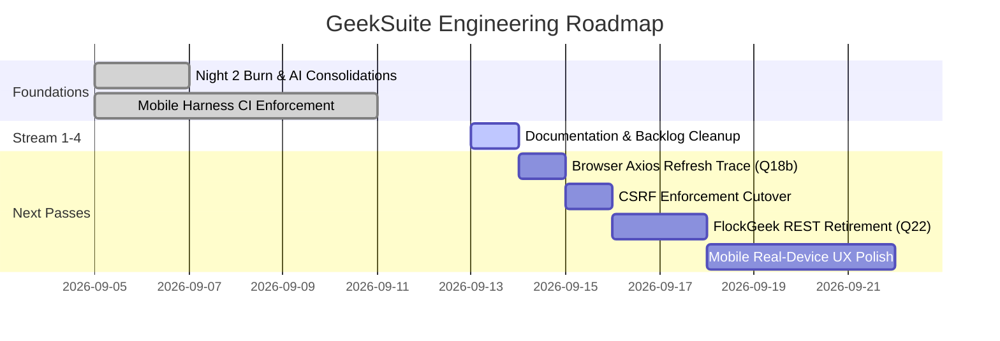

# GeekSuite — The Plan

Strategic roadmap, current operational status, open architectural decisions, and upcoming engineering passes.
Maintained by Sage for alignment with Chef and the engineering squad.

---

## 1. Current Operational Status

The suite is stable, quiet, and fully verified:

- **Night 2 Engineering Burn Complete**: Waves 18–25 landed, consolidating the five AI features onto a single unified runner (`aiFeatureRunner`), deploying free-tier resilience adapters, and fixing the Cloudflare chat-adapter timeout fault.
- **Mobile Harness Enforcing**: Playwright-based mobile grammar probe (`tools/mobile-harness`) runs in CI (`.github/workflows/mobile-harness.yml`), asserting 139 scenes across iPhone 14 viewports (dark and light modes). All 8 apps maintain 0 violations (touch target ≥44px, text ≥12px, no horizontal scroll).
- **Fleet Health**: All 8 application containers (`basegeek`, `bookgeek`, `bujogeek`, `fitnessgeek`, `flockgeek`, `notegeek`, `startgeek`, `storygeek`) and 4 shared datastore containers are active, monitored with Docker healthchecks, and configured with bounded JSON log rotation (`10m`, 3 files).
- **CI & Quality Gates Enforcing**:
  - CI matrix runs 14+ frontend/backend test suites with ~600 tests added.
  - AST-level syntax gate (`node tools/syntax-check.mjs`) checks all JS/MJS/CJS files.
  - GraphQL schema & argument audit (`node tools/gql-arg-audit.mjs`) validates frontend query documents against the gateway SDL.
  - Mobile harness runs on every PR and push affecting UI surfaces.

---

## 2. Chef's Open Decision Items

The active backlog has been reconciled. All items currently pending action are explicit product decisions or operational authorizations reserved for Chef:

### 2.1 Q18b: `CSRF_TOKEN=enforce` Rollout Gate
- **Context**: Double-submit CSRF protection (`geek_csrf` cookie + `X-CSRF-Token` header) is implemented across all 8 apps and running in `report` mode on basegeek.
- **Current Observation**: Logs show ~5 report-only hits per 24-hour window on `POST /api/auth/refresh` from an `axios/1.13.5` client. All 6 backend reverse proxies forward the CSRF header correctly, confirming the missing header originates from a browser-side refresh caller.
- **Action Plan**:
  1. Identify and patch the specific browser-side Axios refresh caller omitting `X-CSRF-Token`.
  2. Verify 24 consecutive hours of zero `CSRF token check (report-only)` log warnings.
  3. Obtain Chef approval to flip `CSRF_TOKEN=enforce` in `apps/basegeek/.env.production` and restart.

### 2.2 Free-Tier AI Resilience Monitor
- **Context**: AIGeek integrates Cloudflare Workers AI, Google Gemini, and Groq free tiers with automatic fallback routing.
- **Action Plan**:
  1. Monitor rate-limit hits and quota exhaustion events in production logs.
  2. Verify graceful degradation to secondary providers and deterministic cached responses when external APIs throttle.
  3. Evaluate provider cost reporting accuracy in AIGeek director view.

### 2.3 Parked Architectural Decisions
- **Q1**: Restart `storygeek` container with `.env.production` mounted to pick up its newly minted `AI_GEEK_API_KEY` service key.
- **Q10**: Revoke legacy `LocalApps` API key once no remaining local clients require it.
- **Q22**: Unmount caller-less REST CRUD layer in `flockgeek` (`routes/api.js`) and retain only `/api/health`.
- **Q38**: Delete orphaned `apps/basegeek/packages/api/src/graphql/storygeek` gateway module (StoryGeek runs on direct REST backend).
- **Q42**: Confirm container timezone policy — retain clean UTC across all Docker images.
- **Q48**: Triage 14 cheap follow-up cleanups documented in `DOCS/ARCHIVE/FITNESSGEEK_MODEL_CONSOLIDATION.md` §12.

---

## 3. Next Planned Passes & Engineering Roadmap

### 3.1 Pass 1: Documentation & Backlog Consolidation (In-Flight)
- Establish canonical Sage session files (`THE_CONTEXT.md`, `THE_PLAN.md`, `THE_STEPS.md`).
- Prune `DOCS/SUITE_TODO.md` down to live, actionable work; archive historical completed logs to `DOCS/ARCHIVE/LANDED_2026_LOGS.md`.
- Retire completed sprint/audit artifacts into `DOCS/ARCHIVE/`.
- Align root `README.md` with current shared packages and tools.

### 3.2 Pass 2: CSRF Final Enforcement (Q18b)
- Trace the remaining Axios refresh caller without CSRF headers.
- Achieve clean 24-hour log window.
- Execute restart cutover to `CSRF_TOKEN=enforce`.

### 3.3 Pass 3: Backend Thinning & Orphan Removal
- Execute Q22 (FlockGeek REST layer unmounting).
- Execute Q38 (StoryGeek gateway schema cleanup).
- Address NoteGeek intermittent `getTagHierarchy` 500 edge case.
- Wire `installShutdownHooks` from `@geeksuite/logger` into backend servers.

### 3.4 Pass 4: Mobile & Visual Experience Polish
- Real-device physical testing on iOS Safari and Android Chrome PWAs.
- Refine BookGeek button contrast and mobile shelf filtering.
- Standardize auth-hydration splash screens across cold-start sessions.
