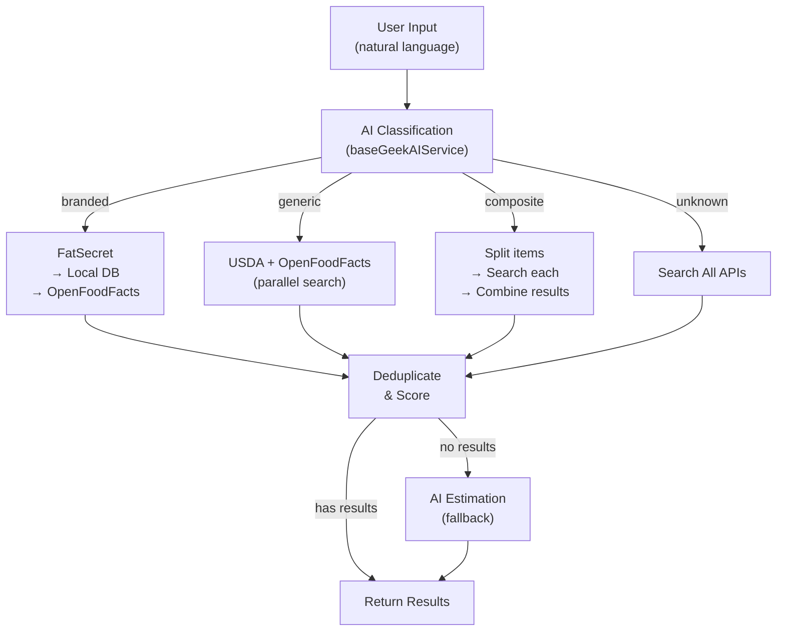
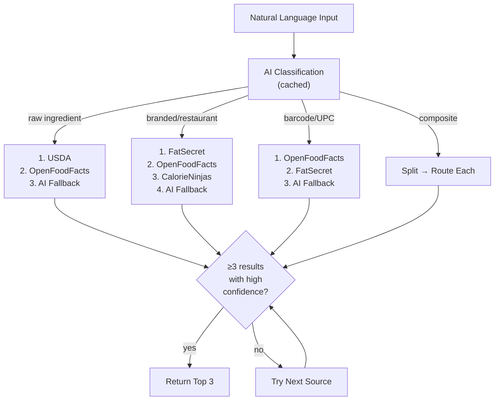
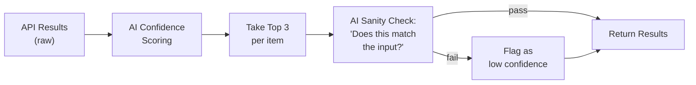

# Food Lookup System - Current State & Improvement Plan

## Executive Summary

The food lookup system currently uses AI-powered classification to route queries to appropriate data sources. This document describes the existing architecture and proposes improvements to achieve the goal of **returning 3 high-confidence results** using intelligent natural language parsing and multi-API fallback chains.

---

## Current Architecture

### Service Overview



### Key Files

| File | Lines | Purpose |
|------|-------|---------|
| [unifiedFoodService.js](file:///Users/ccrocker/projects/fitnessGeek/backend/src/services/unifiedFoodService.js) | 716 | **Main orchestrator** - AI classification, smart routing, composite handling |
| [foodApiService.js](file:///Users/ccrocker/projects/fitnessGeek/backend/src/services/foodApiService.js) | 284 | USDA + OpenFoodFacts with 7-day caching |
| [fatSecretService.js](file:///Users/ccrocker/projects/fitnessGeek/backend/src/services/fatSecretService.js) | 332 | OAuth2 branded food lookup (5k calls/day free) |
| [openFoodFactsService.js](file:///Users/ccrocker/projects/fitnessGeek/backend/src/services/openFoodFactsService.js) | 116 | Barcode & product search (free, unlimited) |
| [baseGeekAIService.js](file:///Users/ccrocker/projects/fitnessGeek/backend/src/services/baseGeekAIService.js) | 347 | AI classification & food parsing |
| [aiClassificationCacheService.js](file:///Users/ccrocker/projects/fitnessGeek/backend/src/services/aiClassificationCacheService.js) | - | Caches AI classification results |

### Current Classification Types

The AI classifies input into one of 4 types:

| Type | Description | Current Priority |
|------|-------------|-----------------|
| `branded` | Restaurant/packaged brand detected | FatSecret → Local → OpenFoodFacts |
| `generic` | Raw ingredient without brand | All APIs (parallel) |
| `composite` | Multiple items ("2 tacos and a beer") | Split → Search each → Combine |
| `unknown` | Cannot determine | Search all APIs |

### Current Data Sources

| Source | Type | Limit | Best For |
|--------|------|-------|----------|
| **USDA FoodData Central** | Generic/Raw | Needs API key | Raw ingredients, nutritional accuracy |
| **OpenFoodFacts** | Branded | Unlimited (free) | Barcodes, international products |
| **FatSecret** | Branded | 5,000/day (free tier) | Restaurant items, US branded products |
| **Local MongoDB** | Custom | Unlimited | User-created items, cached results |
| **AI Estimation** | Fallback | Per AI limits | Last resort when no API matches |

---

## What's Working Well

✅ **AI Classification** - Correctly identifies branded vs generic vs composite queries
✅ **FatSecret Integration** - OAuth2 working, good for Starbucks/Chipotle/McDonald's
✅ **Composite Handling** - Splits multi-item queries and searches each separately
✅ **Caching** - 7-day cache on API results, classification caching
✅ **Relevance Scoring** - `scoreRelevance()` method ranks results by match quality
✅ **Deduplication** - Removes duplicate results by name+brand

---

## Current Gaps

### 1. Missing: USDA Priority for Raw Ingredients
- Generic foods currently search *all* APIs in parallel
- USDA should be **primary** for raw ingredients (chicken, apple, rice)
- Current: `searchAPIs()` → parallel FatSecret + USDA + OpenFoodFacts
- Desired: Generic → USDA **first**, fallback to others only if low confidence

### 2. Missing: CalorieNinjas Integration
- No `calorieNinjasService.js` exists
- Free tier: **10,000 calls/month** (vs FatSecret's 5,000/day)
- Good for natural language parsing and additional branded coverage
- Lower priority than FatSecret but useful as fallback

### 3. Missing: Confidence-Based Return (3 High-Confidence Results)
- Current: Returns up to `limit` results (default 25)
- Desired: Stop searching once **3 high-confidence matches** are found
- Should define confidence thresholds per source

### 4. Missing: Source-Priority by Item Type
Desired routing:

| Item Type | Priority Chain |
|-----------|---------------|
| Raw ingredient | USDA → OpenFoodFacts → AI |
| Branded/packaged | FatSecret → OpenFoodFacts → CalorieNinjas → AI |
| UPC/Barcode | OpenFoodFacts → FatSecret → AI |
| Restaurant | FatSecret → CalorieNinjas → AI |

### 5. Missing: Early Termination
- Currently searches all sources even if first source returns perfect matches
- Should short-circuit when high-confidence results found

### 6. Configuration Gap
- `USDA_API_KEY` not documented in `env.example`
- No `CALORIENINJAS_API_KEY` configuration

### 7. Missing: AI Sanity Check on Results
- Currently returns raw API results without validation
- API results can be irrelevant ("chicken" returns "chicken of the sea tuna")
- Need AI to:
  1. Score each result's confidence relative to the original query
  2. Return only top 3 per item with highest relevance
  3. Final sanity check: "Does this match what the user asked for?"

---

## Proposed Improvements

### Phase 1: Enhance Routing Logic



### Phase 2: Add CalorieNinjas Service
- Create `calorieNinjasService.js`
- API: `https://api.calorieninjas.com/v1/nutrition`
- Auth: Simple API key header
- Rate limit: 10,000/month (less than FatSecret's daily limit, so use as fallback)

### Phase 3: Confidence Scoring System

```javascript
// Proposed confidence levels
const CONFIDENCE = {
  VERIFIED: 100,    // Exact barcode match
  HIGH: 80,         // Exact name match from trusted source
  MEDIUM: 60,       // Partial match, good source
  LOW: 40,          // Fuzzy match or AI estimation
  ESTIMATED: 20     // Pure AI guess
};

// Target: Return when we have 3 results >= MEDIUM confidence
```

### Phase 4: Early Termination
- Search sources sequentially (within priority chain)
- Stop when 3 HIGH confidence results found
- Fall through only if confidence insufficient

### Phase 5: AI Sanity Check Layer

After collecting API results, run a **lightweight AI validation pass**:



**AI Confidence Scoring Prompt (cheap call):**
```
Given the user's input: "[original query]"
Rate each result's relevance (0-100):
1. [result name] - [source]
2. [result name] - [source]
...
Return JSON: [{"index": 1, "score": 85, "reason": "exact match"}...]
```

**AI Sanity Check Prompt (final validation):**
```
User asked for: "[original query]"
We're returning:
1. [result 1]
2. [result 2]
3. [result 3]

Do these results match what the user asked for?
Return: {"valid": true/false, "issues": ["result 2 is wrong type"]}
```

---

## API Status Summary

| API | Status | Free Tier | Notes |
|-----|--------|-----------|-------|
| **USDA FoodData Central** | ✅ Integrated | Unlimited (with key) | Best for raw ingredients |
| **OpenFoodFacts** | ✅ Integrated | Unlimited | Best for barcodes |
| **FatSecret** | ✅ Integrated | 5,000/day | Best for branded/restaurant |
| **CalorieNinjas** | ❌ Not Integrated | 10,000/month | Good fallback, natural language |
| **AI Estimation** | ✅ Integrated | Per AI limits | Last resort |

---

## Success Criteria

After improvements, the system should:

1. **Parse natural language** → AI breaks "2 scrambled eggs with toast and coffee" into 3 items
2. **Route intelligently** → Raw ingredients hit USDA first, branded hit FatSecret first
3. **Score results with AI** → Each API result rated for relevance to original query
4. **Return top 3 per item** → Best matches only, ranked by AI confidence score
5. **Sanity check before return** → AI validates final results match user intent
6. **Handle UPC** → OpenFoodFacts primary for barcode scans
7. **Fail gracefully** → AI estimation as last resort, clearly marked as "estimated"

---

## Next Steps

See [THE_LOOKUP_STEPS.md](file:///Users/ccrocker/projects/fitnessGeek/DOCS/THE_LOOKUP_STEPS.md) for detailed implementation steps.
